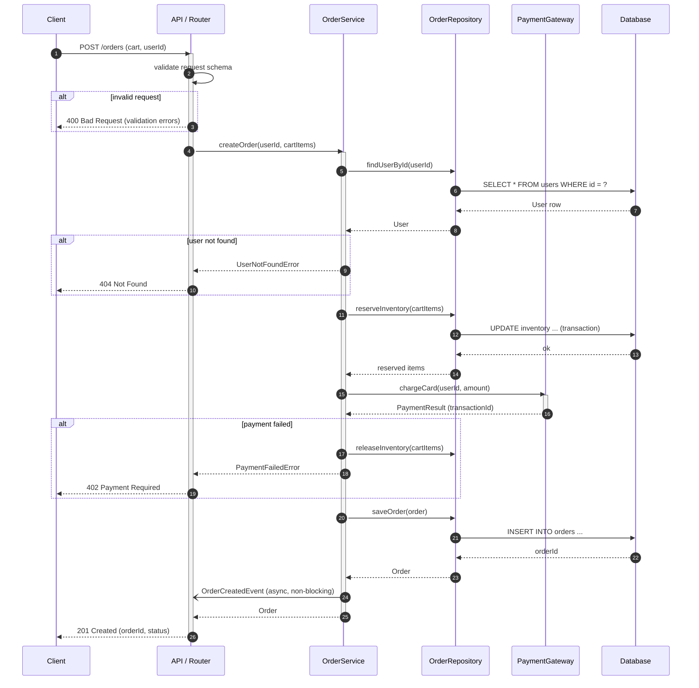
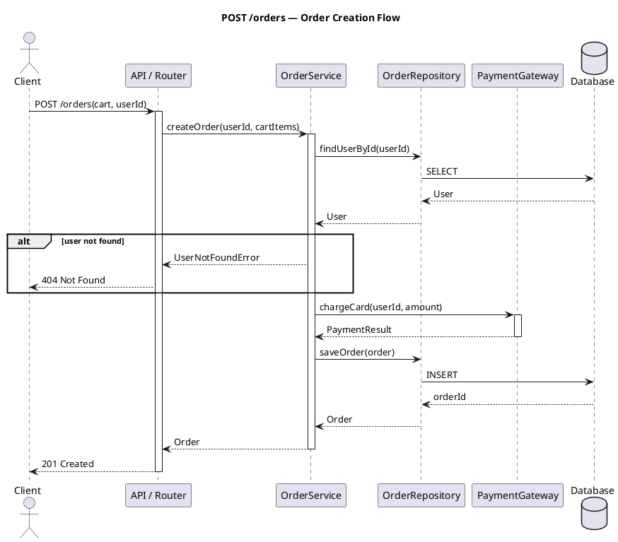

Generate Mermaid sequence diagrams for API call flows and business process flows by
reading the source code and tracing execution paths end-to-end. Produces embeddable
Mermaid diagrams saved to `docs/diagrams/`.

Read `CLAUDE.md` and `docs/context/tech-stack.md` to understand the stack and conventions
before generating anything.

---

## Step 1: Identify the Target

Parse `$ARGUMENTS` to determine what to diagram:

| Input | Meaning |
|-------|---------|
| `POST /orders` | Single API endpoint flow |
| `checkout` / `payment` / `auth` | Named business flow (scan for matching service/handler) |
| `all` or empty | Discover and diagram all significant flows |

If the target is empty or `all`, scan the codebase to discover flows:
- **API flows**: read all router/controller/handler files — one diagram per endpoint or
  per resource group (e.g., one diagram for all `/orders` endpoints)
- **Business flows**: read service-layer files and identify non-trivial operations
  (multi-step processes, async pipelines, cross-service calls, state transitions)

Prioritize flows that are:
1. Core to the domain (checkout, auth, data ingestion, payment processing)
2. Complex (3+ participants or 5+ steps)
3. Not already diagrammed in `docs/diagrams/`

---

## Step 2: Read Source Files

For each flow, read the relevant source files — do not guess at call sequences:
- Entry points: routes, controllers, command handlers, event listeners, scheduled jobs
- Application layer: services, use cases, application commands/queries
- Domain layer: aggregates, domain services, entities
- Infrastructure layer: repositories, external API clients, message publishers
- Cross-cutting: middleware, auth guards, error handlers

Trace the full path:
```
Client → [Middleware] → Handler → Service → [Repository / External] → Response
```

For async flows, identify: queues, events, webhooks, background jobs.

---

## Step 3: Identify Participants and Messages

For each flow, extract:

**Participants** — name them from left to right in call order:
- Use short, role-based names (e.g., `Client`, `API`, `OrderService`, `PaymentGateway`, `DB`)
- Group infrastructure under one participant when internals are not the focus
  (e.g., `DB` rather than separate read/write replicas)

**Messages** — for each function call or I/O operation:
- Synchronous call: `A->>B: actionName(params)`
- Async / fire-and-forget: `A-)B: eventName`
- Return / response: `B-->>A: result`

**Control structures** — use these where the code uses them:
- Conditional: `alt condition / else / end`
- Optional path: `opt condition / end`
- Loop: `loop condition / end`
- Parallel: `par / and / end`
- Error handling: `alt success / else error / end`

**Activation boxes** — use `activate` / `deactivate` to show when a participant is
processing (keeps long diagrams readable).

---

## Step 4: Generate Mermaid Sequence Diagrams

Produce one `.md` file per flow in `docs/diagrams/`. Use this template:

````markdown
# <Flow Name>

**Trigger:** <what initiates this flow — HTTP request, event, scheduled job, etc.>
**Happy path:** <one-sentence summary of the successful outcome>
**Error paths:** <comma-separated list of failure modes covered>



## Notes

- `reserveInventory` runs inside a DB transaction — rolled back on payment failure.
- `OrderCreatedEvent` triggers the fulfilment pipeline asynchronously; the HTTP response
  does not wait for it.
- Payment retry logic is handled inside `PaymentGateway` — not shown here.
````

**Diagram quality rules:**
- `autonumber` is always on — makes diagrams easier to reference in reviews
- Keep participant aliases short (≤ 6 chars); use `as` for readable full names
- Do not show trivial getters or framework internals (e.g., DI container wiring)
- Annotate messages with the actual method/function name, not a generic "call"
- Limit diagrams to ≤ 30 steps; split longer flows into sub-diagrams (e.g., `checkout-payment.md`, `checkout-fulfilment.md`)

---

## Step 5: Generate PlantUML (Optional)

If `$ARGUMENTS` includes `--plantuml` or the project already uses PlantUML (check for `.puml` files), also produce a PlantUML version:



Save as `docs/diagrams/<flow-name>.puml`.

Render locally with:
```bash
# Docker (no install)
docker run --rm -v "$(pwd)/docs/diagrams:/data" plantuml/plantuml:latest /data/<flow>.puml
# Output: docs/diagrams/<flow>.png

# Or with npm wrapper
npm install -g node-plantuml
puml generate docs/diagrams/<flow>.puml --output docs/diagrams/
```

---

## Step 6: Index and Embed

After generating all diagrams, update or create `docs/diagrams/README.md`:

```markdown
# Sequence Diagrams

| Diagram | Flow | Type | Last Updated |
|---------|------|------|-------------|
| [checkout-order.md](checkout-order.md) | POST /orders — Order creation | API | YYYY-MM-DD |
| [checkout-payment.md](checkout-payment.md) | Payment processing sub-flow | Business | YYYY-MM-DD |
| [auth-login.md](auth-login.md) | POST /auth/login — JWT issuance | API | YYYY-MM-DD |
| [password-reset.md](password-reset.md) | Password reset flow | Business | YYYY-MM-DD |
```

If `docs/architecture/overview.md` exists, suggest the embed location for each diagram.

---

## Step 7: Output Summary

```
Sequence Diagrams Generated
═══════════════════════════════════════════════════════

Output directory : docs/diagrams/

Diagrams generated:
  docs/diagrams/checkout-order.md         ← POST /orders (happy path + 3 error paths)
  docs/diagrams/checkout-payment.md       ← Payment sub-flow
  docs/diagrams/auth-login.md             ← POST /auth/login
  docs/diagrams/password-reset.md         ← Password reset (email + token)
  docs/diagrams/README.md                 ← Index (updated)

Flows found but not diagrammed (trivial / < 3 participants):
  - GET /health  ← single-participant, skip
  - GET /users/:id  ← recommend adding if you want full API coverage

Diagram format : Mermaid (sequenceDiagram) with autonumber
PlantUML       : not generated (pass --plantuml to enable)

Next steps:
  1. Review each diagram against the code — correct any missed branches
  2. Embed diagrams in docs/architecture/overview.md where relevant
  3. Add to docs site: copy docs/diagrams/ into docs-site/docs/diagrams/
  4. Commit: git add docs/diagrams/ && git commit -m "docs(diagrams): add sequence diagrams for <flows>"
```

---

Target flow, endpoint, or "all": $ARGUMENTS
