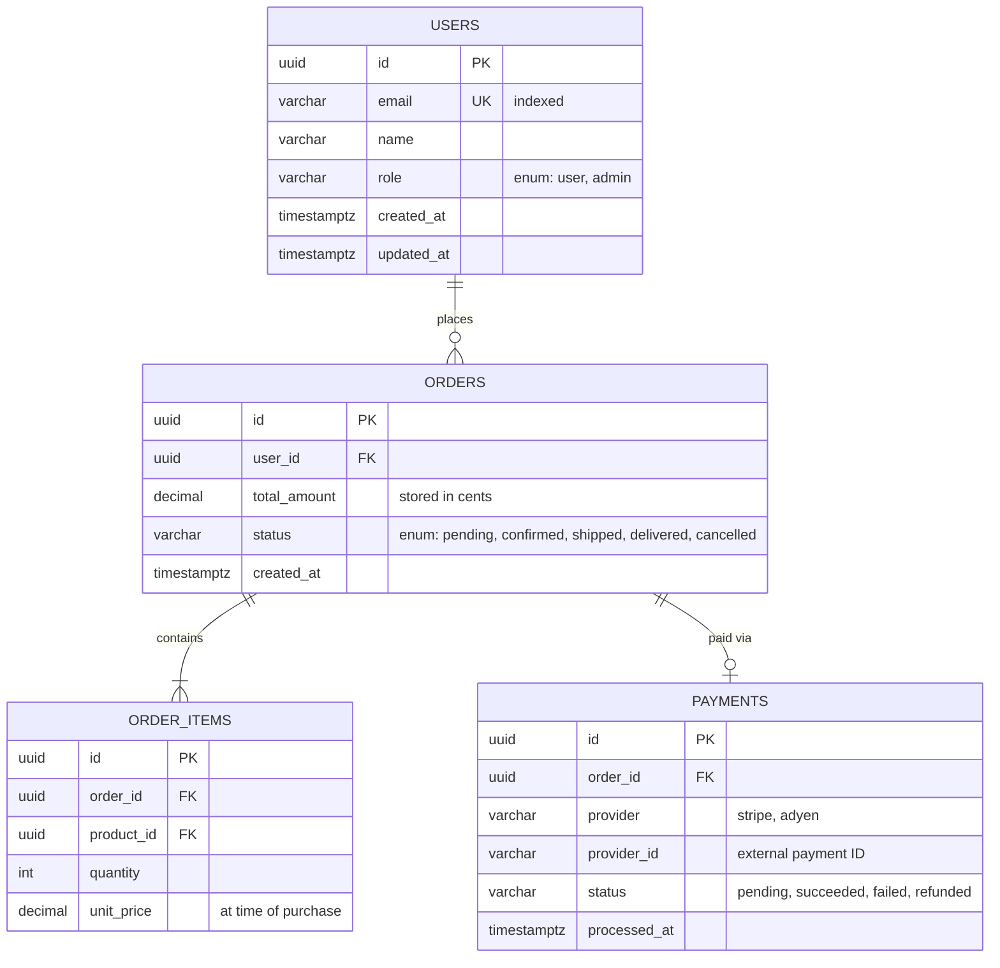

Generate comprehensive database schema documentation: entity-relationship diagrams,
table descriptions, constraint summaries, and index analysis. Supports PostgreSQL, MySQL,
SQLite, MongoDB, and any database accessible via the project's connection string.

---

## Step 1: Detect Database Type and Access

Read `CLAUDE.md` and `docs/context/tech-stack.md` to identify:
- Database type (PostgreSQL, MySQL, SQLite, MongoDB, etc.)
- ORM / migration tool (Drizzle, Prisma, SQLAlchemy, Hibernate, EF Core, Room, etc.)
- Connection details (from `.env` or `DATABASE_URL`)
- Whether to use **live introspection** (connect to DB) or **schema-first** (read migrations/schema files)

Prefer schema-first if a live connection is unavailable — it produces equally good docs
and doesn't require DB access during generation.

---

## Step 2: Choose Documentation Strategy

| Approach | When to use | Tool |
|----------|------------|------|
| **Live introspection** | Dev/CI DB accessible | SchemaSpy, tbls |
| **Migration-based** | Read migration files | Parse Flyway/Alembic/Prisma schema |
| **ORM schema** | Prisma schema.prisma / SQLAlchemy models | Parse declarative schema |
| **DBML hand-written** | No live DB; want doc-first | DBML + dbdocs.io |

---

## Step 3: Generate ERD and Table Documentation

### Via SchemaSpy (PostgreSQL/MySQL — live introspection)

```bash
# Generate schema docs in docs/database/
docker run --rm \
  -v "$(pwd)/docs/database:/output" \
  --network host \
  schemaspy/schemaspy:6.0 \
  -t pgsql \
  -host localhost \
  -port 5432 \
  -db ${DB_NAME} \
  -u ${DB_USER} \
  -p ${DB_PASS} \
  -o /output \
  -all

# Output: docs/database/index.html (interactive ERD + table docs)
```

### Via tbls (fastest, Markdown output)

```bash
# Install: go install github.com/k1LoW/tbls@latest
# Or: brew install k1low/tap/tbls

# Config file (.tbls.yml)
cat > .tbls.yml << 'EOF'
dsn: ${DATABASE_URL}
docPath: docs/database
format:
  adjust: true
  number: false
er:
  format: svg
  comment: true
EOF

tbls doc  # → docs/database/ Markdown + SVG ERD
```

### Via Prisma Schema

```bash
# If using Prisma — generate Mermaid ERD from schema.prisma
npx prisma-erd-generator
# Or: npx @prisma/internals introspect → schema.prisma
# Then: npx prisma generate
```

### Via DBML (schema-first or hand-written)

Read the ORM model files and produce DBML:
```
# For each table/entity, generate DBML notation:
Table <table_name> {
  <column_name> <type> [<constraints>]
  ...
  Note: '<table description>'
  indexes { (<columns>) [unique/pk/note] }
}
Ref: <table1.column> <relation_symbol> <table2.column>
```

Relations: `>` (many-to-one), `<` (one-to-many), `-` (one-to-one), `<>` (many-to-many)

Then generate docs from DBML:
```bash
npm install -g @dbml/cli
dbml2html schema.dbml -o docs/database/schema.html
```

---

## Step 4: Generate Mermaid ERD (Always — embeds in Markdown)

Regardless of which tool is used, produce an embeddable Mermaid ERD:

```markdown
## Entity Relationship Diagram


```

---

## Step 5: Generate Table Reference Documentation

For each table, produce:

```markdown
## Table: `orders`

**Purpose:** Stores customer orders from initial placement through fulfilment.
One order per purchase session. Line items stored in `order_items`.

### Columns

| Column | Type | Nullable | Default | Description |
|--------|------|----------|---------|-------------|
| `id` | `uuid` | No | `gen_random_uuid()` | Primary key |
| `user_id` | `uuid` | No | — | FK → `users.id` (CASCADE DELETE) |
| `total_amount` | `integer` | No | — | Total in smallest currency unit (cents) |
| `status` | `varchar(20)` | No | `'pending'` | Workflow state (see Status enum below) |
| `created_at` | `timestamptz` | No | `now()` | When order was placed |
| `updated_at` | `timestamptz` | No | `now()` | Last status change (trigger-maintained) |

### Status Enum
| Value | Meaning | Next States |
|-------|---------|------------|
| `pending` | Placed, awaiting payment | `confirmed`, `cancelled` |
| `confirmed` | Payment received | `shipped`, `cancelled` |
| `shipped` | Dispatched to carrier | `delivered` |
| `delivered` | Delivered to customer | — (terminal) |
| `cancelled` | Order cancelled | — (terminal) |

### Indexes
| Name | Columns | Type | Purpose |
|------|---------|------|---------|
| `orders_pkey` | `id` | Primary | — |
| `idx_orders_user_id` | `user_id` | B-tree | List orders by user |
| `idx_orders_status` | `status` | B-tree | Filter by status |
| `idx_orders_created_at` | `created_at DESC` | B-tree | Date-range queries |

### Constraints
- `fk_orders_user` — `user_id` REFERENCES `users(id)` ON DELETE CASCADE
- `chk_orders_total` — `total_amount >= 0`

### Row Volume
- Estimated: TODO (rows today, growth rate)
- Partitioned: No / Yes (TODO: partition key)
- Archived after: TODO days
```

---

## Step 6: Index and Performance Analysis

Read all `CREATE INDEX` statements (or ORM equivalents) and report:

**Index coverage check:**
- [ ] Every foreign key column has an index
- [ ] Columns used in WHERE clauses with high selectivity are indexed
- [ ] Composite indexes are ordered by selectivity (most selective first)

**Potential missing indexes:**
```sql
-- Find foreign keys without indexes (PostgreSQL)
SELECT conrelid::regclass AS table, a.attname AS column
FROM pg_constraint c
JOIN pg_attribute a ON a.attnum = ANY(c.conkey) AND a.attrelid = c.conrelid
WHERE c.contype = 'f'
  AND NOT EXISTS (
    SELECT 1 FROM pg_index i
    WHERE i.indrelid = c.conrelid
    AND a.attnum = ANY(i.indkey)
  );
```

Report any tables with no indexes (excluding primary key), and large tables without a
covering index for their most common query pattern.

---

## Step 7: Output Summary

Save all generated documentation to `docs/database/`:

```
Database Documentation Generated
═══════════════════════════════════════════════════════

Output directory : docs/database/
Database         : PostgreSQL 16 @ localhost:5432/<db>

Generated files:
  docs/database/index.html          ← Interactive ERD (SchemaSpy/tbls)
  docs/database/schema.md           ← Markdown reference (all tables)
  docs/database/erd.mermaid.md      ← Embeddable Mermaid ERD
  docs/database/schema.dbml         ← DBML source

Tables documented : N
  With descriptions         : N/N
  Missing descriptions      : N  ← add COMMENT ON TABLE ... in a migration

Columns documented : N
  With descriptions         : N
  Missing descriptions      : N

Index analysis:
  Indexes found             : N
  Missing FK indexes        : N  ← consider adding
  Potential redundant indexes: N  ← review for removal

Next steps:
  1. Review and add missing table/column descriptions
  2. Add missing indexes for foreign keys
  3. Embed erd.mermaid.md in docs/architecture/overview.md
  4. If using docs site: copy to docs-site/docs/database/
  5. Commit: git add docs/database/ && git commit -m "docs(schema): generate database documentation"
```

---

Target (optional — "live", "migrations", "prisma", "dbml", or table name): $ARGUMENTS
