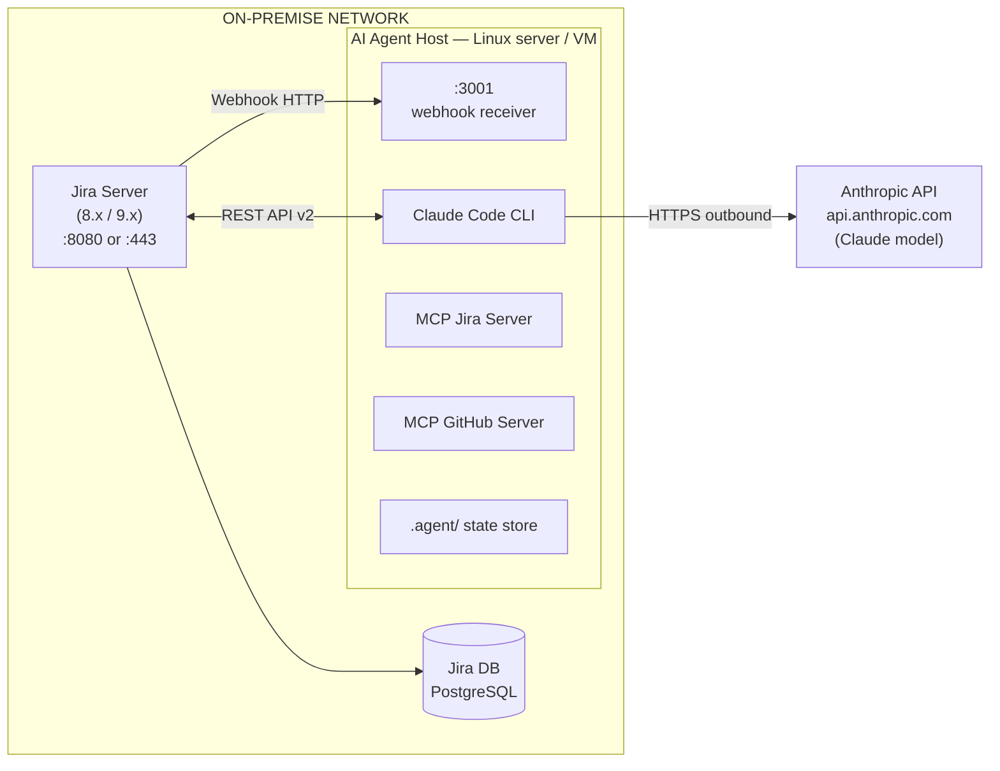

# Jira Server — Autonomous Agent Setup Guide

**Audience:** Platform operators and DevOps engineers responsible for deploying the autonomous
AI development agent against an on-premise Jira Server installation.

**Scope:** End-to-end setup from Jira Server admin configuration through network topology,
credential management, MCP server wiring, agent configuration, webhook setup, validation,
security hardening, and troubleshooting.

---

## Table of Contents

1. [Architecture Overview](#1-architecture-overview)
2. [Prerequisites](#2-prerequisites)
3. [Jira Server Administration](#3-jira-server-administration)
4. [Authentication Strategy](#4-authentication-strategy)
5. [Network Topology & Connectivity](#5-network-topology--connectivity)
6. [MCP Server Installation & Configuration](#6-mcp-server-installation--configuration)
7. [agent.config.yaml — Jira Server Section](#7-agentconfigyaml--jira-server-section)
8. [Claude Code Settings & Environment Variables](#8-claude-code-settings--environment-variables)
9. [Webhook Configuration (Event-Driven Mode)](#9-webhook-configuration-event-driven-mode)
10. [Polling Mode (Alternative to Webhooks)](#10-polling-mode-alternative-to-webhooks)
11. [Validate End-to-End](#11-validate-end-to-end)
12. [Security Hardening](#12-security-hardening)
13. [Monitoring & Observability](#13-monitoring--observability)
14. [Troubleshooting Reference](#14-troubleshooting-reference)
15. [Runbook — Day-2 Operations](#15-runbook--day-2-operations)

---

## 1. Architecture Overview



### Key Differences: Jira Server vs Jira Cloud

| Aspect | Jira Server (On-Premise) | Jira Cloud |
|--------|--------------------------|-----------|
| Base URL | `https://jira.yourcompany.com` | `https://yourcompany.atlassian.net` |
| REST API version | `/rest/api/2/` | `/rest/api/3/` |
| Authentication | Basic Auth (user:password) **or** Personal Access Token (8.14+) | API Token (always) |
| OAuth | OAuth 1.0a (complex) | OAuth 2.0 (simpler) |
| Webhooks | Admin Console → System → Webhooks | Atlassian Connect / Admin Console |
| User identifier | Username (login name) | Email address |
| Network | Reachable only within corporate network / VPN | Public internet |
| Certificates | Often self-signed or internal CA | Public CA |

---

## 2. Prerequisites

### Agent Host Requirements

| Requirement | Minimum | Recommended |
|-------------|---------|-------------|
| OS | Ubuntu 22.04 LTS | Ubuntu 24.04 LTS |
| CPU | 2 vCPU | 4 vCPU |
| RAM | 4 GB | 8 GB |
| Disk | 20 GB | 50 GB (for audit logs) |
| Node.js | 20.x LTS | 22.x LTS |
| Network | Bidirectional to Jira Server | Same subnet preferred |
| Outbound HTTPS | `api.anthropic.com:443` | — |

### Jira Server Requirements

| Requirement | Notes |
|-------------|-------|
| **Version** | Jira Software 8.x or 9.x (8.14+ strongly preferred for PAT support) |
| **Admin access** | You need Jira System Administrator rights |
| **REST API enabled** | Enabled by default; verify at `<jira-url>/rest/api/2/serverInfo` |
| **Webhook plugin** | Built-in since Jira 6; no plugin needed |
| **Service account license** | One Jira Software license seat for the agent user |

### Accounts and Access Needed

- [ ] Jira System Administrator credentials (for setup only)
- [ ] Service account created in Jira (the agent will act as this user)
- [ ] GitHub Personal Access Token (for PR creation via MCP GitHub server)
- [ ] Anthropic API key
- [ ] Slack Incoming Webhook URL (for escalation notifications)

---

## 3. Jira Server Administration

### 3.1 Create the Agent Service Account

Log in as a Jira administrator:

1. Navigate to **Jira Administration → User Management → Create User**
2. Set the following:

   | Field | Value |
   |-------|-------|
   | **Username** | `ai-agent` |
   | **Full Name** | `AI Development Agent` |
   | **Email** | `ai-agent@yourcompany.com` (use a monitored mailbox) |
   | **Password** | Generate a strong random password (≥ 32 chars) — store in your secrets manager |

3. Assign a **Jira Software** license seat to this user.

### 3.2 Configure Project Permissions

For each project the agent should access:

1. Go to **Project Settings → Permissions**
2. Grant the agent service account (or a dedicated agent group) these permissions:

   | Permission | Required | Reason |
   |------------|---------|--------|
   | Browse Projects | ✅ | Read issue details |
   | View Development Tools | ✅ | Read linked commits |
   | Create Issues | ✅ | Create sub-tasks if needed |
   | Edit Issues | ✅ | Update status, add comments |
   | Assign Issues | ✅ | Assign to agent during processing |
   | Add Comments | ✅ | Post triage decisions and escalations |
   | Transition Issues | ✅ | Move issue through workflow (To Do → In Progress → Done) |
   | Link Issues | Optional | Link related issues |
   | Delete Issues | ❌ | Never grant this |

   **Best practice:** Create a Jira Group called `ai-agent-group`, add the service account to it, and grant permissions to the group.

### 3.3 Configure Issue Workflow Transitions

The agent needs to transition issues through your workflow. Map your workflow states:

1. Go to **Jira Administration → Issues → Workflows**
2. View the workflow used by your target projects
3. Note the exact transition names (they are case-sensitive in JQL and API calls)
4. Update `agent.config.yaml` → `jira.status_transitions` to match (see Section 7)

Common workflow mapping (adjust to yours):

```
To Do → [agent accepts] → In Progress
In Progress → [agent creates PR] → In Review
In Review → [PR merged, deployed] → Done
In Progress → [agent cannot proceed] → Blocked
```

### 3.4 Configure Personal Access Token (Jira Server 8.14+)

**Strongly recommended** over Basic Auth for security.

1. Log in as the `ai-agent` service account
2. Go to **Profile (top-right avatar) → Personal Access Tokens**
3. Click **Create token**
4. Set:
   - **Token name:** `autonomous-agent-production`
   - **Automatic expiry:** Set to 365 days (or per your security policy)
5. Copy the token immediately — it is shown only once
6. Store it in your secrets manager (see Section 8)

> **If using Jira Server < 8.14:** Use Basic Auth (username:password). The MCP server sends
> `Authorization: Basic base64(username:password)`. The password is the account password, not
> a PAT. This is less secure — rotate the password quarterly.

### 3.5 Verify API Access

Test from the agent host machine:

```bash
# Test with PAT (Jira Server 8.14+)
curl -s \
  -H "Authorization: Bearer YOUR_PAT_TOKEN" \
  -H "Content-Type: application/json" \
  "https://jira.yourcompany.com/rest/api/2/myself" | jq '{displayName, emailAddress, active}'

# Expected output:
# {
#   "displayName": "AI Development Agent",
#   "emailAddress": "ai-agent@yourcompany.com",
#   "active": true
# }

# Test with Basic Auth (older Jira Server)
curl -s \
  -u "ai-agent:YOUR_PASSWORD" \
  -H "Content-Type: application/json" \
  "https://jira.yourcompany.com/rest/api/2/myself" | jq '{displayName, active}'
```

If the response contains `"active": true`, authentication is working.

---

## 4. Authentication Strategy

### Option A: Personal Access Token (Recommended — Jira 8.14+)

```
Authorization: Bearer <PAT>
```

Advantages:
- Token can be revoked without changing the account password
- Fine-grained expiry control
- Audit log shows token name, not just username

### Option B: Basic Authentication (Jira < 8.14)

```
Authorization: Basic base64("ai-agent:password")
```

The MCP server handles encoding automatically when you provide `JIRA_USERNAME` and `JIRA_API_TOKEN` (set token = password in this case).

### Option C: OAuth 1.0a (Advanced — for enterprise SSO environments)

Only needed if your Jira Server is configured to reject Basic Auth and require OAuth. This is uncommon for service accounts.

Setup is complex and out of scope for this guide. Refer to [Atlassian OAuth 1.0a documentation](https://developer.atlassian.com/server/jira/platform/oauth/) if required.

### Self-Signed / Internal CA Certificates

If your Jira Server uses an internal certificate authority:

```bash
# Export your internal CA cert (ask your IT team for the .crt file)
# Then configure Node.js to trust it:

# Option 1: System-level (preferred)
sudo cp your-internal-ca.crt /usr/local/share/ca-certificates/
sudo update-ca-certificates

# Option 2: Node.js environment variable (set in your .env)
NODE_EXTRA_CA_CERTS=/path/to/your-internal-ca.crt

# Verify:
curl --cacert /path/to/your-internal-ca.crt \
  "https://jira.yourcompany.com/rest/api/2/serverInfo"
```

---

## 5. Network Topology & Connectivity

### 5.1 Required Network Paths

| Source | Destination | Port | Protocol | Purpose |
|--------|------------|------|----------|---------|
| Agent Host | Jira Server | 443 or 8080 | HTTPS/HTTP | REST API calls |
| Jira Server | Agent Host | 3001 (configurable) | HTTP/HTTPS | Webhook delivery |
| Agent Host | `api.anthropic.com` | 443 | HTTPS | Claude API |
| Agent Host | `github.com` | 443 | HTTPS | PR creation via MCP |
| Agent Host | Slack Webhook URL | 443 | HTTPS | Escalation notifications |

### 5.2 Firewall Rules

Work with your network team to open these rules:

```
# Outbound from Agent Host
ALLOW agent-host → jira-server:443 TCP
ALLOW agent-host → api.anthropic.com:443 TCP
ALLOW agent-host → github.com:443 TCP
ALLOW agent-host → slack-webhook-domain:443 TCP

# Inbound to Agent Host (for Jira webhooks)
ALLOW jira-server → agent-host:3001 TCP
```

### 5.3 VPN / Proxy Configuration

**If agent runs outside the corporate network:**

```bash
# HTTP proxy (if required by corporate network)
export HTTP_PROXY=http://proxy.yourcompany.com:8080
export HTTPS_PROXY=http://proxy.yourcompany.com:8080
export NO_PROXY=localhost,127.0.0.1,jira.yourcompany.com

# For Node.js MCP servers, also set:
export NODE_TLS_REJECT_UNAUTHORIZED=0   # ONLY if using internal CA that can't be imported
# Better alternative: set NODE_EXTRA_CA_CERTS instead
```

**If agent runs inside the corporate network (recommended):**
- No proxy configuration needed
- Direct TCP connection to Jira Server
- Only outbound internet access needed for Anthropic API and GitHub

### 5.4 Webhook Receiver Endpoint

The agent exposes an HTTP endpoint that Jira pushes events to. This must be reachable from the Jira Server.

If the agent host is not directly reachable from Jira Server, options:

| Option | Use When | Notes |
|--------|---------|-------|
| Direct network path | Agent on same corporate network | Simplest; configure firewall rule |
| Nginx reverse proxy | Agent behind NAT | Route `jira.yourcompany.com → agent-host:3001` |
| ngrok tunnel | Development / testing only | `ngrok http 3001` — NOT for production |
| VPN + direct path | Agent in different subnet | Establish VPN between networks |

---

## 6. MCP Server Installation & Configuration

### 6.1 Install the Jira MCP Server

On the agent host:

```bash
# Install globally (used by Claude Code's MCP integration)
npm install -g mcp-server-jira

# Verify installation
mcp-server-jira --version

# Alternative: use npx (no global install needed — Claude Code handles this)
npx mcp-server-jira --help
```

### 6.2 Test the MCP Server Manually

Before wiring into Claude Code, verify the MCP server can reach Jira:

```bash
# With PAT auth
JIRA_URL="https://jira.yourcompany.com" \
JIRA_EMAIL="ai-agent" \
JIRA_API_TOKEN="your-pat-token" \
npx mcp-server-jira

# The server starts and exposes Jira tools over stdio.
# In a separate terminal, send a test JSON-RPC call:
echo '{"jsonrpc":"2.0","id":1,"method":"tools/list","params":{}}' | \
  JIRA_URL="https://jira.yourcompany.com" \
  JIRA_EMAIL="ai-agent" \
  JIRA_API_TOKEN="your-pat-token" \
  npx mcp-server-jira
```

Expected: a JSON response listing available tools (`jira_get_issue`, `jira_search`, `jira_create_comment`, etc.).

### 6.3 Configure .cursor/mcp.json

```json
{
  "mcpServers": {
    "jira": {
      "command": "npx",
      "args": ["-y", "mcp-server-jira"],
      "env": {
        "JIRA_URL":       "${env:JIRA_URL}",
        "JIRA_EMAIL":     "${env:JIRA_EMAIL}",
        "JIRA_API_TOKEN": "${env:JIRA_API_TOKEN}"
      },
      "description": "On-premise Jira Server — REST API v2"
    }
  }
}
```

> **Note on `JIRA_EMAIL` for on-premise Jira Server:** This field holds the **username**
> (login name), not an email address. The Jira Server REST API v2 uses username for Basic Auth
> and PAT auth (the token is scoped to the user regardless of how the field is named in the
> MCP server configuration).

### 6.4 MCP Server Environment Variables Reference

| Variable | On-Premise Jira Server Value | Notes |
|----------|------------------------------|-------|
| `JIRA_URL` | `https://jira.yourcompany.com` | No trailing slash. Include port if non-standard: `:8080` |
| `JIRA_EMAIL` | `ai-agent` (the **username**, not email) | Some MCP server versions accept email; use username for Server |
| `JIRA_API_TOKEN` | Your PAT token (8.14+) or account password | Store in secrets manager — never in plain .env committed to git |
| `NODE_EXTRA_CA_CERTS` | `/path/to/internal-ca.crt` | Only if Jira uses internal/self-signed TLS certificate |
| `HTTPS_PROXY` | `http://proxy.yourcompany.com:8080` | Only if HTTP proxy is required |

---

## 7. agent.config.yaml — Jira Server Section

Complete configuration for on-premise Jira Server. Replace all `YOUR_*` placeholders:

```yaml
agent:
  mode: semi-autonomous
  id: "YOUR_PROJECT_SLUG-agent"
  name: "YOUR_PROJECT Dev Agent"

issue_tracker:
  provider: jira

  jira:
    # -----------------------------------------------------------------------
    # Connection — On-Premise Jira Server
    # -----------------------------------------------------------------------
    server_url: "https://jira.yourcompany.com"    # No trailing slash
    # Include port if non-standard:
    # server_url: "https://jira.yourcompany.com:8443"

    api_version: "2"                              # MUST be "2" for Jira Server
                                                  # (Cloud uses "3")

    project_key: "YOUR_PROJECT_KEY"               # e.g., "MYAPP", "BACKEND"

    # -----------------------------------------------------------------------
    # Credentials (resolved from environment at runtime)
    # -----------------------------------------------------------------------
    # For Jira Server 8.14+ with PAT:
    username_env: "JIRA_EMAIL"                    # Contains the login USERNAME (not email)
    api_token_env: "JIRA_API_TOKEN"               # Contains the PAT token

    # For Jira Server < 8.14 (Basic Auth with password):
    # username_env: "JIRA_EMAIL"                  # Login username
    # api_token_env: "JIRA_PASSWORD"              # Account password

    # -----------------------------------------------------------------------
    # TLS — for internal CA or self-signed certificates
    # -----------------------------------------------------------------------
    # ca_cert_path: "/etc/ssl/certs/internal-ca.crt"   # Uncomment if needed

    # -----------------------------------------------------------------------
    # Backlog Query (JQL)
    # Fetches candidate issues for the agent to triage
    # -----------------------------------------------------------------------
    backlog_jql: >
      project = "YOUR_PROJECT_KEY"
      AND status = "To Do"
      AND issuetype in (Story, Task, Bug)
      AND priority in (High, Highest)
      AND labels not in ("agent-rejected", "agent-in-progress", "agent-done")
      ORDER BY priority DESC, created ASC

    # -----------------------------------------------------------------------
    # Polling (used when webhooks are not configured)
    # -----------------------------------------------------------------------
    poll_interval_minutes: 15

    # -----------------------------------------------------------------------
    # Workflow Status Transitions
    # IMPORTANT: Must exactly match your Jira workflow transition names.
    # Find them: Jira Admin → Issues → Workflows → view your workflow
    # -----------------------------------------------------------------------
    status_transitions:
      start:      "Start Progress"       # Transition to "In Progress"
      review:     "Submit for Review"    # Transition to "In Review"
      done:       "Mark as Done"         # Transition to "Done"
      blocked:    "Block"                # Transition to "Blocked"
      rejected:   "Reject"              # Transition to "Rejected"

    # -----------------------------------------------------------------------
    # Labels the agent applies to issues it processes
    # -----------------------------------------------------------------------
    labels:
      accepted:    "agent-accepted"
      in_progress: "agent-in-progress"
      rejected:    "agent-rejected"
      escalated:   "agent-escalated"
      done:        "agent-done"

    # -----------------------------------------------------------------------
    # Webhook receiver (for event-driven mode — see Section 9)
    # -----------------------------------------------------------------------
    webhook:
      enabled: true
      receiver_host: "http://YOUR_AGENT_HOST_IP:3001"  # Reachable FROM Jira Server
      path: "/jira-webhook"
      secret: "${env:JIRA_WEBHOOK_SECRET}"             # Shared secret for validation

domain:
  boundaries_file: "docs/context/domain-boundaries.md"
  acceptance_threshold: 0.80
  rejection_threshold: 0.30

autonomy:
  mode: semi-autonomous
  gates:
    triage:
      confidence_threshold: 0.80
    implement:
      max_retries: 3
      max_hours: 8
  require_approval_for_risk:
    - high
  task_timeout_hours: 24
  max_concurrent_tasks: 1

escalation:
  primary_channel: slack
  slack:
    webhook_url_env: "SLACK_WEBHOOK_URL"
    channel: "#dev-agent-alerts"

git:
  base_branch: "main"
  branch_pattern: "feat/{issue_id}-{issue_slug}"
  branch_patterns_by_type:
    bug: "fix/{issue_id}-{issue_slug}"
    task: "chore/{issue_id}-{issue_slug}"

observability:
  audit_log:
    enabled: true
    path: ".agent/audit/{date}-decisions.jsonl"
  state_store:
    backend: file
    path: ".agent/state/"
  cost_tracking:
    enabled: true
    daily_budget_usd: 50.00

safety:
  protected_paths:
    - "agent.config.yaml"
    - ".github/workflows/**"
    - "**/.env"
  forbidden_commands:
    - "rm -rf"
    - "DROP TABLE"
    - "git push --force"
  max_files_per_pr: 30
  kill_switch_file: ".agent/STOP"
```

---

## 8. Claude Code Settings & Environment Variables

### 8.1 .env File (Agent Host)

Create `/opt/ai-agent/project/.env` (never commit this file):

```env
# =======================================================================
# AI Agent — Environment Variables
# DO NOT COMMIT — contains credentials
# =======================================================================

# Anthropic (required)
ANTHROPIC_API_KEY=sk-ant-api03-...

# Jira Server (required)
JIRA_URL=https://jira.yourcompany.com
JIRA_EMAIL=ai-agent                             # Login USERNAME (not email address)
JIRA_API_TOKEN=YOUR_PAT_TOKEN_OR_PASSWORD       # PAT (8.14+) or password (older)
JIRA_WEBHOOK_SECRET=randomly-generated-32-char-secret

# GitHub (required for PR creation)
GITHUB_TOKEN=ghp_...

# Slack (required for escalation notifications)
SLACK_WEBHOOK_URL=https://hooks.slack.com/services/T.../B.../...

# TLS (only if Jira uses internal CA)
# NODE_EXTRA_CA_CERTS=/etc/ssl/certs/internal-ca.crt

# Proxy (only if HTTP proxy is required)
# HTTPS_PROXY=http://proxy.yourcompany.com:8080
# NO_PROXY=localhost,127.0.0.1,jira.yourcompany.com
```

Set restrictive permissions:
```bash
chmod 600 .env
chown $(whoami) .env
```

### 8.2 Secrets Manager Integration (Production)

For production deployments, do not use a plain `.env` file. Instead, load secrets at runtime:

**HashiCorp Vault:**
```bash
# Example: load secrets from Vault into environment before starting agent
export JIRA_API_TOKEN=$(vault kv get -field=pat secret/ai-agent/jira)
export ANTHROPIC_API_KEY=$(vault kv get -field=key secret/ai-agent/anthropic)
```

**AWS Secrets Manager:**
```bash
JIRA_API_TOKEN=$(aws secretsmanager get-secret-value \
  --secret-id ai-agent/jira-pat \
  --query SecretString \
  --output text | jq -r .pat)
```

**Systemd environment file (for service deployments):**
```ini
# /etc/systemd/system/ai-agent.service
[Service]
EnvironmentFile=/opt/ai-agent/.env
ExecStart=/usr/bin/claude --headless /opt/ai-agent/project
```

### 8.3 Validate Secrets Are Loaded

```bash
# Source .env and verify all required vars are set
source .env

required_vars=(ANTHROPIC_API_KEY JIRA_URL JIRA_EMAIL JIRA_API_TOKEN GITHUB_TOKEN)
for var in "${required_vars[@]}"; do
  if [ -z "${!var}" ]; then
    echo "MISSING: $var"
  else
    echo "OK: $var (length: ${#!var})"
  fi
done
```

---

## 9. Webhook Configuration (Event-Driven Mode)

Webhooks allow Jira to push events to the agent immediately when an issue is created or
updated — eliminating the polling delay.

### 9.1 Start the Webhook Receiver

The agent exposes a simple HTTP server on port 3001 that receives Jira events.

Create the webhook receiver script at `.agent/webhook-receiver.mjs`:

```javascript
// .agent/webhook-receiver.mjs
// Listens for Jira Server webhook events and triggers the agent loop

import { createServer } from 'node:http';
import { createHmac, timingSafeEqual } from 'node:crypto';
import { execSync } from 'node:child_process';
import { appendFileSync, mkdirSync, existsSync } from 'node:fs';

const PORT = process.env.WEBHOOK_PORT ?? 3001;
const SECRET = process.env.JIRA_WEBHOOK_SECRET;
const LOG_DIR = '.agent/audit';

if (!SECRET) { console.error('JIRA_WEBHOOK_SECRET not set'); process.exit(1); }
if (!existsSync(LOG_DIR)) mkdirSync(LOG_DIR, { recursive: true });

const log = (entry) => {
  const line = JSON.stringify({ timestamp: new Date().toISOString(), ...entry });
  appendFileSync(`${LOG_DIR}/${new Date().toISOString().split('T')[0]}-webhooks.jsonl`, line + '\n');
  console.log(line);
};

function validateSignature(body, signature) {
  // Jira Server webhooks can optionally send a shared secret in a custom header.
  // Since Jira Server does not natively sign webhook payloads (unlike GitHub),
  // we validate by checking a shared secret sent in a custom header.
  // Configure your Jira webhook with a secret header: X-Jira-Secret: <secret>
  return timingSafeEqual(
    Buffer.from(signature ?? '', 'utf8'),
    Buffer.from(SECRET, 'utf8')
  );
}

createServer((req, res) => {
  if (req.method !== 'POST' || req.url !== '/jira-webhook') {
    res.writeHead(404); res.end(); return;
  }

  const secretHeader = req.headers['x-jira-secret'];
  if (!validateSignature(null, secretHeader)) {
    log({ event: 'webhook_rejected', reason: 'invalid_secret', ip: req.socket.remoteAddress });
    res.writeHead(401); res.end('Unauthorized'); return;
  }

  let body = '';
  req.on('data', chunk => { body += chunk; if (body.length > 1e6) req.destroy(); });
  req.on('end', () => {
    try {
      const payload = JSON.parse(body);
      const { webhookEvent, issue } = payload;

      log({ event: 'webhook_received', webhookEvent, issueKey: issue?.key, issueSummary: issue?.fields?.summary });

      // Trigger triage only for relevant events
      const triggerEvents = ['jira:issue_created', 'jira:issue_updated'];
      if (triggerEvents.includes(webhookEvent) && issue?.key) {
        // Fire and forget — agent handles async
        setImmediate(() => {
          try {
            execSync(`claude --headless "/triage ${issue.key}: ${issue.fields.summary}"`, {
              cwd: process.cwd(),
              env: process.env,
              stdio: 'inherit',
              timeout: 300_000  // 5 minute timeout for triage
            });
          } catch (err) {
            log({ event: 'triage_trigger_error', issueKey: issue.key, error: err.message });
          }
        });
      }

      res.writeHead(200, { 'Content-Type': 'application/json' });
      res.end(JSON.stringify({ received: true, issueKey: issue?.key }));
    } catch (err) {
      log({ event: 'webhook_parse_error', error: err.message });
      res.writeHead(400); res.end('Bad Request');
    }
  });
}).listen(PORT, '0.0.0.0', () => {
  log({ event: 'webhook_receiver_started', port: PORT });
  console.log(`Jira webhook receiver listening on :${PORT}/jira-webhook`);
});
```

Start the receiver:
```bash
JIRA_WEBHOOK_SECRET=your-secret node .agent/webhook-receiver.mjs &
```

### 9.2 Configure the Webhook in Jira Server Admin

1. Log in as a **Jira System Administrator**
2. Navigate to **Jira Administration (cog icon) → System → Webhooks**
3. Click **+ Create a Webhook**
4. Configure:

   | Field | Value |
   |-------|-------|
   | **Name** | `AI Agent — Issue Events` |
   | **Status** | Enabled |
   | **URL** | `http://YOUR_AGENT_HOST_IP:3001/jira-webhook` |
   | **Secret** | Leave blank (Jira Server doesn't natively sign; we use a custom header below) |
   | **Events — Issue** | ✅ Created, ✅ Updated |
   | **Events — Comment** | ✅ Created (for `AGENT_RESUME` commands) |
   | **Events — Other** | Leave unchecked |
   | **JQL Filter** | `project = "YOUR_PROJECT_KEY" AND issuetype in (Story, Task, Bug)` |

5. Click **Save**

### 9.3 Add the Shared Secret Header

Jira Server webhook configuration does not support custom request headers natively through
the UI. To send the shared secret header, use one of these approaches:

**Option A: Nginx reverse proxy with header injection (recommended)**

```nginx
# /etc/nginx/sites-available/jira-webhook-proxy
server {
    listen 3002;
    location /jira-webhook {
        proxy_pass http://localhost:3001/jira-webhook;
        proxy_set_header X-Jira-Secret "your-shared-secret";
        proxy_set_header X-Real-IP $remote_addr;
    }
}
```

Set the Jira webhook URL to `http://YOUR_AGENT_HOST_IP:3002/jira-webhook`.
The nginx proxy injects the secret header before forwarding to the receiver.

**Option B: IP allowlist only (simpler, less secure)**

Allow only the Jira Server's IP in the webhook receiver:
```javascript
// Add to webhook receiver:
const ALLOWED_IPS = new Set(['10.0.1.50']);  // Jira Server IP
if (!ALLOWED_IPS.has(req.socket.remoteAddress)) {
  res.writeHead(403); res.end('Forbidden'); return;
}
```

And remove the secret header validation.

### 9.4 Test the Webhook

```bash
# Simulate a Jira webhook POST from the agent host:
curl -X POST http://localhost:3001/jira-webhook \
  -H "Content-Type: application/json" \
  -H "X-Jira-Secret: your-shared-secret" \
  -d '{
    "webhookEvent": "jira:issue_created",
    "issue": {
      "key": "PROJ-99",
      "fields": {
        "summary": "Test webhook delivery",
        "status": { "name": "To Do" },
        "issuetype": { "name": "Story" }
      }
    }
  }'

# Expected response:
# {"received":true,"issueKey":"PROJ-99"}
```

Check the webhook log:
```bash
cat .agent/audit/$(date +%Y-%m-%d)-webhooks.jsonl | jq .
```

---

## 10. Polling Mode (Alternative to Webhooks)

Use polling when webhooks are not feasible (e.g., Jira Server is not reachable from the
agent host network, or firewall rules cannot be changed).

### 10.1 Schedule the Grooming Command

Create a systemd timer (Linux) or cron job:

**Systemd timer (recommended):**

```ini
# /etc/systemd/system/ai-agent-groom.service
[Unit]
Description=AI Agent — Jira Backlog Grooming
After=network.target

[Service]
Type=oneshot
User=ai-agent
WorkingDirectory=/opt/ai-agent/project
EnvironmentFile=/opt/ai-agent/.env
ExecStart=/usr/bin/claude --headless "/groom"
StandardOutput=append:/var/log/ai-agent/groom.log
StandardError=append:/var/log/ai-agent/groom.log
TimeoutStartSec=600

[Install]
WantedBy=multi-user.target
```

```ini
# /etc/systemd/system/ai-agent-groom.timer
[Unit]
Description=Run AI Agent Grooming every 15 minutes
Requires=ai-agent-groom.service

[Timer]
OnBootSec=2min
OnUnitActiveSec=15min
Unit=ai-agent-groom.service
AccuracySec=30s

[Install]
WantedBy=timers.target
```

```bash
sudo systemctl daemon-reload
sudo systemctl enable --now ai-agent-groom.timer
sudo systemctl status ai-agent-groom.timer
```

**Cron job (simpler alternative):**

```cron
# /etc/cron.d/ai-agent
*/15 * * * * ai-agent cd /opt/ai-agent/project && \
  source .env && \
  /usr/bin/claude --headless "/groom" >> /var/log/ai-agent/groom.log 2>&1
```

---

## 11. Validate End-to-End

Run this checklist after completing setup:

### 11.1 Connectivity Tests

```bash
# 1. Agent host → Jira Server API
curl -sf \
  -H "Authorization: Bearer $JIRA_API_TOKEN" \
  "$JIRA_URL/rest/api/2/serverInfo" | jq '{version, buildNumber}'

# 2. Agent host → Anthropic API
curl -sf \
  -H "Authorization: Bearer $ANTHROPIC_API_KEY" \
  -H "anthropic-version: 2023-06-01" \
  "https://api.anthropic.com/v1/models" | jq '.models[0].id'

# 3. Agent host → GitHub API
curl -sf \
  -H "Authorization: Bearer $GITHUB_TOKEN" \
  "https://api.github.com/user" | jq .login

# 4. Jira webhook → Agent host (run from Jira Server or any host that can reach agent)
curl -sf -X POST http://AGENT_HOST:3001/jira-webhook \
  -H "Content-Type: application/json" \
  -H "X-Jira-Secret: $JIRA_WEBHOOK_SECRET" \
  -d '{"webhookEvent":"test","issue":{"key":"TEST-1","fields":{"summary":"connectivity test"}}}'
```

### 11.2 Jira API Tests

```bash
# Fetch a real issue from the target project
curl -sf \
  -H "Authorization: Bearer $JIRA_API_TOKEN" \
  "$JIRA_URL/rest/api/2/issue/YOUR_PROJECT_KEY-1" | jq '{key, summary: .fields.summary, status: .fields.status.name}'

# Run the backlog JQL query
curl -sf \
  -H "Authorization: Bearer $JIRA_API_TOKEN" \
  -H "Content-Type: application/json" \
  -d "{\"jql\": \"project = YOUR_PROJECT_KEY AND status = 'To Do' ORDER BY priority DESC\", \"maxResults\": 5}" \
  "$JIRA_URL/rest/api/2/search" | jq '.issues[] | {key, summary: .fields.summary}'
```

### 11.3 Agent Command Tests

```bash
# Navigate to the project directory
cd /opt/ai-agent/project

# Test 1: Triage a single known issue
claude --headless "/triage YOUR_PROJECT_KEY-1"
# Expected: JSON output with confidence score and ACCEPT/REJECT/ESCALATE decision

# Test 2: Run grooming (dry run — check output before it modifies Jira)
claude --headless "/groom"
# Expected: list of triaged issues with decisions, no errors

# Test 3: Check state directory was created
ls -la .agent/
# Expected: state/ audit/ directories present
```

### 11.4 End-to-End Smoke Test

1. Create a test issue in Jira: `YOUR_PROJECT_KEY` project, type "Task", priority "High"
2. Add the title: `[AGENT TEST] Smoke test — add logging utility function`
3. Wait 15 minutes (polling) or observe webhook delivery
4. Check agent logs:
   ```bash
   cat .agent/audit/$(date +%Y-%m-%d)-decisions.jsonl | jq .
   ```
5. Verify in Jira that the issue has been:
   - Transitioned to "In Progress"
   - Labelled `agent-accepted`
   - Commented with the triage decision

---

## 12. Security Hardening

### 12.1 Service Account Principle of Least Privilege

Review the permissions granted in Section 3.2. Remove any permissions not listed there.
Specifically verify:
```bash
# Confirm the service account cannot delete issues
curl -s \
  -H "Authorization: Bearer $JIRA_API_TOKEN" \
  "$JIRA_URL/rest/api/2/mypermissions?projectKey=YOUR_PROJECT_KEY" | \
  jq '.permissions | {DELETE_ISSUES, ADMINISTER_PROJECTS}'
# Both should be false or absent
```

### 12.2 Rotate Credentials

| Credential | Rotation Frequency | Procedure |
|------------|-------------------|-----------|
| Jira PAT | Every 90 days | Create new PAT → update secret → delete old PAT |
| Jira password (if used) | Every 90 days | Change in Jira → update secret |
| Webhook secret | Every 180 days | Generate new secret → update Jira webhook config → update .env |
| Anthropic API key | Per Anthropic policy | Rotate in Anthropic Console |
| GitHub token | Every 90 days | Create new token → update secret → revoke old |

### 12.3 Audit Log Protection

```bash
# Prevent audit log tampering
chmod 550 .agent/audit/
chmod 440 .agent/audit/*.jsonl

# Forward logs to a centralized log system (immutable)
# Example: ship to ELK / Splunk / CloudWatch
# Install filebeat or fluent-bit and configure to tail .agent/audit/*.jsonl
```

### 12.4 Network Security

- TLS must be used for all connections to Jira Server (`https://`)
- If Jira uses HTTP internally, place a TLS-terminating reverse proxy in front
- The webhook receiver should also be placed behind TLS in production:
  ```nginx
  server {
      listen 443 ssl;
      ssl_certificate /etc/ssl/certs/agent.crt;
      ssl_certificate_key /etc/ssl/private/agent.key;
      location /jira-webhook { proxy_pass http://localhost:3001; }
  }
  ```

### 12.5 File System Isolation

```bash
# Run the agent as a dedicated non-root user
useradd --system --create-home --shell /bin/bash ai-agent

# Lock down the project directory
chown -R ai-agent:ai-agent /opt/ai-agent/
chmod 750 /opt/ai-agent/
chmod 600 /opt/ai-agent/project/.env
```

---

## 13. Monitoring & Observability

### 13.1 Key Metrics to Monitor

| Metric | Source | Alert Threshold |
|--------|--------|----------------|
| Issues triaged per day | `.agent/audit/*.jsonl` | < 1/day when backlog not empty |
| Acceptance rate | Audit log | < 20% or > 95% (domain config may need tuning) |
| Escalation rate | Audit log | > 30% (agent may be stuck) |
| Task completion time | State files | > `max_hours` from config |
| Webhook delivery failures | Jira Admin → Webhooks | > 0 consecutive failures |
| API cost per task | Audit log `costUsd` field | > daily budget |

### 13.2 Log Monitoring Script

```bash
#!/usr/bin/env bash
# scripts/agent-health-check.sh
# Run daily via cron or CI

AUDIT_DIR=".agent/audit"
TODAY=$(date +%Y-%m-%d)
LOG_FILE="$AUDIT_DIR/$TODAY-decisions.jsonl"

if [ ! -f "$LOG_FILE" ]; then
  echo "WARN: No audit log for today — agent may not have run"
  exit 1
fi

TOTAL=$(wc -l < "$LOG_FILE")
ACCEPTED=$(grep -c '"action":"triage_accepted"' "$LOG_FILE" || true)
REJECTED=$(grep -c '"action":"triage_rejected"' "$LOG_FILE" || true)
ESCALATED=$(grep -c '"escalated":true' "$LOG_FILE" || true)
COMPLETED=$(grep -c '"action":"task_completed"' "$LOG_FILE" || true)
TOTAL_COST=$(jq -s '[.[].costUsd // 0] | add' "$LOG_FILE")

echo "=== AI Agent Health Report — $TODAY ==="
echo "  Total log entries : $TOTAL"
echo "  Accepted          : $ACCEPTED"
echo "  Rejected          : $REJECTED"
echo "  Escalated         : $ESCALATED"
echo "  Tasks completed   : $COMPLETED"
echo "  Total cost (USD)  : \$$TOTAL_COST"

# Alert if escalation rate is high
if [ "$ACCEPTED" -gt 0 ] && [ "$((ESCALATED * 100 / ACCEPTED))" -gt 30 ]; then
  echo "ALERT: High escalation rate (${ESCALATED}/${ACCEPTED})"
  exit 1
fi
```

### 13.3 Jira Webhook Health

Check the Jira webhook delivery status periodically:

1. Navigate to **Jira Administration → System → Webhooks**
2. Click on your webhook to view recent delivery history
3. Failed deliveries indicate the agent webhook receiver is unreachable

Automate via Jira REST API:
```bash
curl -sf \
  -H "Authorization: Bearer $JIRA_API_TOKEN" \
  "$JIRA_URL/rest/api/2/webhook" | jq '.[] | {name, url, lastUpdated}'
```

---

## 14. Troubleshooting Reference

### Connection Issues

| Symptom | Likely Cause | Resolution |
|---------|-------------|-----------|
| `ECONNREFUSED` | Jira Server not reachable on that port | Check firewall rules; verify Jira is running |
| `UNABLE_TO_VERIFY_LEAF_SIGNATURE` | Internal CA not trusted | Set `NODE_EXTRA_CA_CERTS` to your CA cert file |
| `SELF_SIGNED_CERT_IN_CHAIN` | Same as above | Same resolution |
| HTTP 401 Unauthorized | Wrong credentials | Re-verify PAT or password; check `JIRA_EMAIL` is the username, not email |
| HTTP 403 Forbidden | Missing permission | Review Section 3.2; grant the required permission |
| HTTP 404 on issue | Wrong project key or issue doesn't exist | Verify `project_key` in agent.config.yaml |
| Webhook not received | Network path blocked | Verify firewall rule; test with curl from Jira Server host |

### Debugging Commands

```bash
# Check what user the PAT resolves to
curl -s -H "Authorization: Bearer $JIRA_API_TOKEN" \
  "$JIRA_URL/rest/api/2/myself" | jq '{name, displayName, active}'

# List transitions available for an issue
curl -s -H "Authorization: Bearer $JIRA_API_TOKEN" \
  "$JIRA_URL/rest/api/2/issue/PROJ-1/transitions" | \
  jq '.transitions[] | {id, name}'

# Test JQL query directly
curl -s -H "Authorization: Bearer $JIRA_API_TOKEN" \
  -H "Content-Type: application/json" \
  --data-raw '{"jql": "project = PROJ AND status = \"To Do\"", "maxResults": 3}' \
  "$JIRA_URL/rest/api/2/search" | jq '.total, [.issues[].key]'

# Check webhook delivery log
tail -f .agent/audit/$(date +%Y-%m-%d)-webhooks.jsonl | jq .

# Check agent decision log
tail -f .agent/audit/$(date +%Y-%m-%d)-decisions.jsonl | jq .

# View in-flight tasks
ls -la .agent/state/ && cat .agent/state/*.json | jq '{taskId, phase, status}'
```

### JQL Transition Errors

If the agent fails to transition an issue, the workflow transition name in `agent.config.yaml`
doesn't match exactly:

```bash
# List all available transitions for an issue in your workflow
curl -s -H "Authorization: Bearer $JIRA_API_TOKEN" \
  "$JIRA_URL/rest/api/2/issue/PROJ-1/transitions?expand=transitions.fields" | \
  jq '.transitions[] | {id, name, to: .to.name}'
```

Update `agent.config.yaml` → `status_transitions` with the exact names returned.

### Agent Gets Stuck

```bash
# View the current state of all in-flight tasks
for f in .agent/state/*.json; do
  echo "=== $f ==="
  cat "$f" | jq '{taskId, phase, status, lastUpdatedAt, retries}'
done

# Force-resume a specific task
claude --headless "/loop resume PROJ-42"

# Emergency stop
touch .agent/STOP
```

---

## 15. Runbook — Day-2 Operations

### Daily Checks (Automated)

```bash
# Add to cron: 0 9 * * 1-5 ai-agent /opt/ai-agent/project/scripts/agent-health-check.sh
```

### Weekly Tasks

- [ ] Review `.agent/audit/` logs for anomalous patterns
- [ ] Check Jira webhook delivery health in admin console
- [ ] Verify PAT expiry date: `curl ... /myself | jq .tokenExpiry` (if field is exposed)
- [ ] Review `domain-boundaries.md` — is scope still accurate?
- [ ] Check API cost report against budget

### Monthly Tasks

- [ ] Rotate credentials per Section 12.2 schedule
- [ ] Review and prune `.agent/audit/` logs older than retention policy
- [ ] Update `mcp-server-jira` package: `npm update -g mcp-server-jira`
- [ ] Review escalation log — high escalation rate signals domain config needs tuning

### PAT Rotation Procedure

```bash
# 1. Create new PAT in Jira (as the ai-agent user)
#    Jira → Profile → Personal Access Tokens → Create token

# 2. Update the secret in your secrets manager
vault kv put secret/ai-agent/jira pat="NEW_PAT_VALUE"
# or
aws secretsmanager update-secret --secret-id ai-agent/jira-pat --secret-string '{"pat":"NEW_PAT"}'

# 3. Update .env on the agent host (if using file-based secrets)
# Edit /opt/ai-agent/.env and replace JIRA_API_TOKEN value

# 4. Restart any running webhook receiver process
systemctl restart ai-agent-webhook-receiver

# 5. Verify connectivity
curl -sf -H "Authorization: Bearer NEW_PAT" \
  "$JIRA_URL/rest/api/2/myself" | jq .displayName

# 6. Revoke the old PAT in Jira
#    Jira → Profile → Personal Access Tokens → Revoke old token

# 7. Record rotation in your ops log
echo "$(date): Rotated Jira PAT for ai-agent service account" >> /var/log/ai-agent/ops.log
```

### Emergency: Disable the Agent

```bash
# Immediate: create kill switch file
touch .agent/STOP

# The agent will halt before the next phase transition.
# To stop the webhook receiver immediately:
systemctl stop ai-agent-webhook-receiver
# or
pkill -f webhook-receiver.mjs

# To disable the polling timer:
systemctl stop ai-agent-groom.timer
systemctl disable ai-agent-groom.timer

# Remove kill switch when ready to resume:
rm .agent/STOP
systemctl enable --now ai-agent-groom.timer
```
