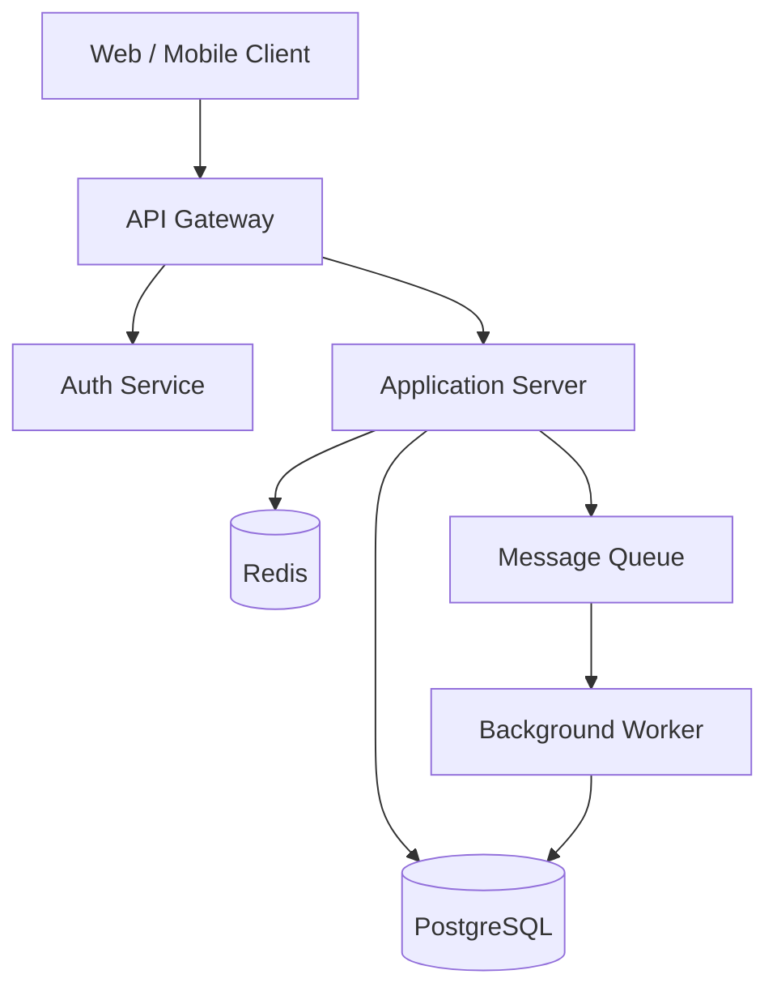

# Architecture Overview

> **CUSTOMIZE THIS FILE.** Replace the examples with your actual architecture.

## System Purpose

TODO: One paragraph describing what this system does and its primary quality attributes
(e.g., "must handle 10k req/s with < 200ms p99 latency and zero data isolation between tenants").

## High-Level Architecture

```
TODO: Replace with your actual architecture diagram using ASCII or Mermaid.

Example (Mermaid — renders in GitHub):



## Component Descriptions

### TODO: Component Name
- **Responsibility**: What this component does
- **Technology**: What it's built with
- **Interfaces**: What APIs / events it exposes
- **Dependencies**: What it depends on

### TODO: Component Name
- **Responsibility**:
- **Technology**:
- **Interfaces**:
- **Dependencies**:

## Data Flow

### TODO: Key User Journey
Describe how data flows through the system for the most important operation.

```
1. User submits request to [entry point]
2. [Component A] validates auth token
3. [Component B] applies business logic
4. [Component C] persists changes
5. [Component D] emits event
6. Response returned to user
```

## Key Architectural Decisions

| Decision | Choice | Rationale | ADR |
|----------|--------|-----------|-----|
| TODO | TODO | TODO | 0001 |
| TODO | TODO | TODO | 0002 |

See `docs/architecture/decisions/` for full ADRs.

## Scalability

TODO: How does the system scale? What are the current bottlenecks? What's the scaling plan?

## Security Architecture

TODO: How is the system secured? Auth mechanism, network boundaries, encryption at rest/transit.

## Operational Concerns

- **Logging**: TODO
- **Monitoring**: TODO
- **Alerting**: TODO
- **Backup & Recovery**: TODO
- **Deployment**: TODO

## Known Limitations & Technical Debt

TODO: Be honest about limitations. This helps AI tools avoid suggesting patterns that don't fit.

- TODO
- TODO

## Future Considerations

TODO: Planned architectural evolution. Helps AI avoid suggesting changes that conflict with the roadmap.

- TODO
